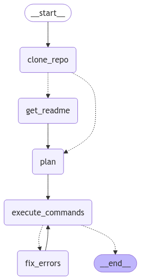

# InstantRun

## Overview

InstantRun is an AI-powered agent designed to autonomously deploy any GitHub repository on a user's local machine. It leverages a LangGraph workflow to handle the entire process, from cloning the repository to executing the necessary commands within a Docker container. This tool aims to simplify the process of setting up and running projects, especially those with complex dependencies or setup procedures.

## Architecture

## Video Demo

Here are the video demos of InstantRun in action:

- Terminal based python snake game: [https://youtu.be/q0lOUSm7raM](https://youtu.be/q0lOUSm7raM)
- Web flask app: [https://youtu.be/2NnVxgIjUvU](https://youtu.be/2NnVxgIjUvU)

## Key Features

-   **Autonomous Deployment:** Automatically clones, sets up, and runs any GitHub repository with minimal user intervention.
-   **Dockerized Environment:** Ensures consistent and isolated execution using Docker, eliminating environment-specific issues.
-   **Intelligent Error Handling:** Detects and attempts to fix errors during the setup process, using the LLM to analyze and correct issues.
-   **Step-by-Step Execution:** Follows a structured LangGraph workflow, ensuring a smooth and predictable deployment process.
-   **LLM Powered:** Utilizes a large language model (LLM) to generate setup plans, fix errors, and extract relevant information from the repository, such as setup instructions from the README.
-   **Dynamic Planning:** Adapts the setup plan based on the repository's content, including the presence of a Dockerfile, requirements.txt, and setup instructions in the README.
-   **Terminal Output:** Provides detailed terminal output for each step, allowing users to monitor the progress and diagnose any issues.

## Workflow

The InstantRun agent follows these steps:

1.  **Clone Repository:** Clones the specified GitHub repository to the local machine using `git clone`.
2.  **Extract File Paths:** Identifies the paths of important files like `README.md` and `requirements.txt` using an LLM to parse the directory structure.
3.  **Get Setup Instructions:** Extracts setup instructions from the `README.md` file, if available, using an LLM to identify the relevant sections.
4.  **Plan Setup:** Generates a detailed plan to set up the repository using Docker. This includes:
    -   Creating a Dockerfile if one doesn't exist.
    -   Generating a list of commands to build and run the Docker container.
    -   Ensuring the plan adheres to the specified JSON output format.
5.  **Execute Commands:** Executes the generated commands, including building the Docker image and running the container. The `docker run` command is prefixed with `alacritty -e` to open a new terminal window.
6.  **Error Check:** Checks for errors after command execution by analyzing the terminal output using an LLM.
7.  **Fix Errors:** If errors are detected, the agent attempts to fix them by:
    -   Using the LLM to analyze the error messages.
    -   Modifying the Dockerfile or commands as needed.
    -   Re-executing the commands.
8.  **Completion:** If no errors are detected, the setup is considered complete, and the final output is displayed.

## Setup Instructions

1.  **Install Dependencies:** Ensure you have Python 3.10 or later, Docker, and the required Python packages installed. You can install the required packages using `pip install -r requirements.txt`.
2.  **Set API Key:** Set your OpenAI API key in the `instantrun.py` file. Replace `'YOUR_API_KEY'` with your actual API key. Also, ensure that the base url is set correctly in the `instantrun.py` file.
3.  **Run the Script:** Execute the `main.py` script. The repository URL is passed as an argument in the `main.py` file.

## Example

To run the script, execute `python main.py`. The `main.py` file is already configured to run the `python-snake` game repository. To run a different repository, change the `github_repo_url` variable in `main.py`.

## Configuration

-   **LLM:** Uses `gpt-4o-mini` as the language model. You can change this in the `instantrun.py` file.
-   **Output Format:** Adheres to a strict JSON output format for all LLM interactions, ensuring consistent parsing.
-   **Docker:** Uses Docker to containerize the repository setup, ensuring a consistent environment.
-   **Operating System:** Designed to work on Arch Linux, but may be adaptable to other Linux distributions with minor modifications.
-   **Python Version:** Uses Python 3.10 or later for Python-based projects.
-   **Dependency Management:** Uses `requirements.txt` for dependency installation in Python projects.

## Notes

-   The `docker run` command will open a new terminal window using `alacritty -e` for terminal ouptut, So make sure alacritty terminal is installed on your machine.
-   The agent is not perfect and may encounter issues with certain repositories or setups. It is recommended to review the terminal output for any errors or issues.

## Contributing

Contributions are welcome! Please feel free to submit pull requests or open issues to improve the functionality and robustness of InstantRun.
